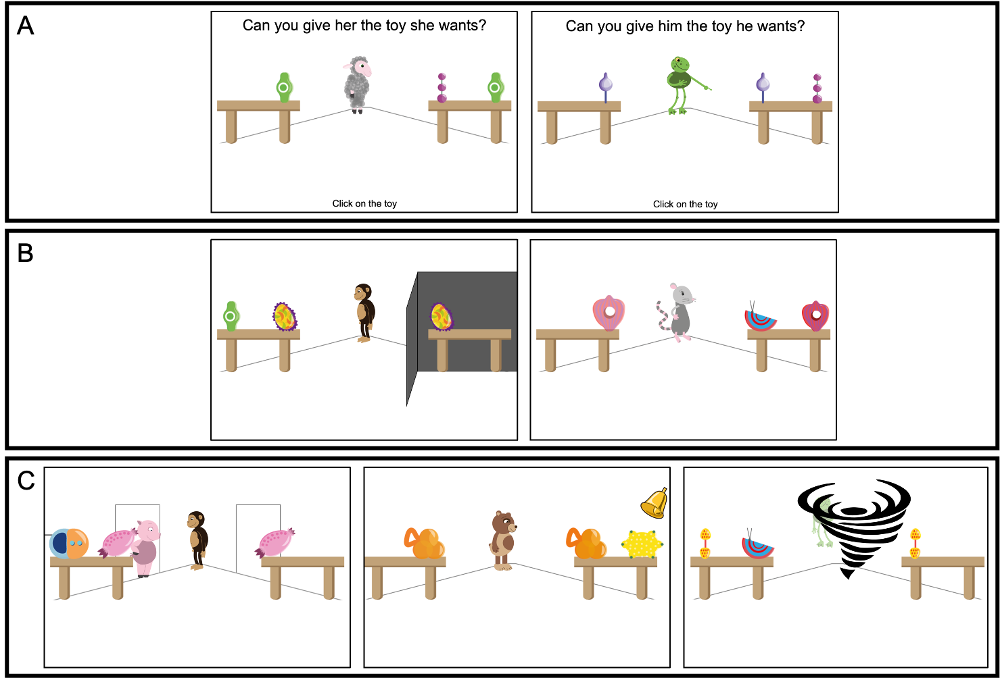
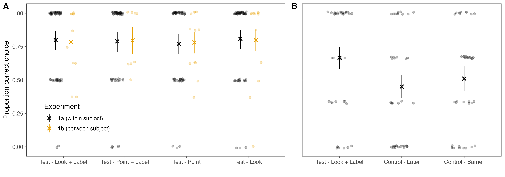
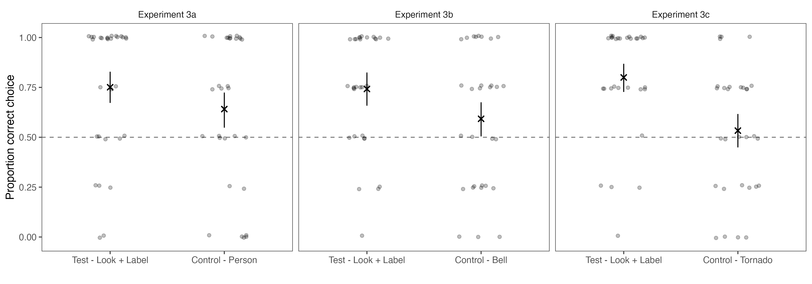

```{r setup, include = FALSE}
library("papaja")
library(tidyverse)
library(BayesFactor)
library(cowplot)
library(tidyboot)
library(brms)
library(scales)
r_refs("r-references.bib")
```

```{r analysis-preferences}
# Seed for random number generation
set.seed(42)
knitr::opts_chunk$set(cache.extra = knitr::rand_seed, warning=F)
```

```{r}
d <-  read_csv("../data/data.csv")
```
# Introduction

Human communication is not reducible to the words and sentences being uttered: there is an inferential gap between what a speaker said and what they meant. We use pragmatic inferences to close this gap and recover the intended meaning. As such, pragmatics is thought to have a central role in everyday language as well as in language learning [@clark1996using; @bohn2019pervasive]. Pragmatic inferences are computed in a social-cognitive reasoning process based on assumptions about how speaker's communicate [@levinson2000presumptive; @sperber2001relevance]. On a Gricean view, these assumptions entail that the speaker communicates in a rational and cooperative way [@grice1991studies]. The speaker is assumed to consider multiple possible utterances from which they intentionally choose the one that is maximally informative to the listener. 

The pragmatic inference process can be described as follows. The listener assumes that in order to communicate an intended meaning, the speaker considers multiple possible utterances. The speaker assesses how informative each utterance is -- how likely it is to convey the intended meaning -- given the context. Finally, the speaker intentionally chooses the most informative utterance. The listener works backwards through these steps and thereby recovers the speaker's intended meaning. 
 
Traditionally, utterances are taken to be linguistic expressions [@sauerland2012computation]. Yet, inspired by evolutionary and developmental thinking, the idea has been put forward that pragmatic inferences are more general and can be derived from all sorts of communicative behaviors, verbal or non-verbal [@sterelny2017code; @tomasello2008origins; @heintz2023expression; @moore2017social]. According to Sperber and Wilson [@sperber2001relevance, see also @tomasello2008origins], any kind of behavior can be used communicatively as long as it is intentionally produced for this purpose (and recognized by the listener as produced that way) [@csibra2009natural]. As a consequence, pragmatic inferences should depend on intentionally produced non-linguistic aspects -- movements, gestures or eye gaze -- of an utterance in just the same way as on linguistic aspects.

Our goal in this paper is to experimentally test three key implications of this view. First, we test if pragmatic inferences can be derived from non-linguistic acts of communication alone. @kampa2023children [see also @kampa2024preschool] have shown that adults and children make pragmatic inferences based on drawings. We advance this work to other non-linguistic expressions such as eye gaze or gestures. Second, we ask if listeners base their inferences on the speaker's epistemic states. This question is central because what the speaker knows determines what alternative utterances they could have used. In other words, intentionally choosing to produce an utterance instead of an alternative requires being aware of the alternative. This step replicates and extends earlier work documenting the use of epistemic states in pragmatic inference [@bergen2012speaker; @breheny2013taking; @wilson2023role; @kampa2020four]. Finally, we assess the importance for pragmatic inference of whether the non-linguistic aspects of a communicative act were produced intentionally or not; an aspect that has not been studied intensely thus far.

In our experimental setup, we focused on how listeners make pragmatic inferences to identify the referent of a novel word [@frank2014inferring; @bohn2022predicting]. As in previous work, a simple pictorial vignette showed a speaker requesting objects; in our case, the objects were lying on tables to either side of the speaker. On one table, there was an object of type A while on the other table was an object of type A and one of type B (see Figure \@ref(fig:fig1)). The speaker always referred to the table with the two objects and -- ambiguously -- requested an object using a non-word (e.g. dax). Based on the analysis above, we expected listeners to reason as follows: the speaker had the option to refer to one of the two tables. The most informative way to refer to object A would have been to refer to the table with only object A on it. The speaker intentionally chose to refer to the other table instead which suggests that they want object B. In the following six experiments we tested if this inference depends on the type of (non-)linguistic signals the speaker used (Experiments 1a and 1b), the speaker's epistemic state (Experiment 2), and the intentional production of all aspects of the utterance (Experiments 3a - 3c). 

# Experiment 1a

Our first experiment tested whether participants made similar pragmatic inferences from linguistic and non-linguistic signals, comparing 1) looking and labeling the object and 2) pointing at and labeling the object with 3) pointing alone and 4) looking alone.

## Methods

The experiment was pre-registered at: https://osf.io/qcwr8. The code to run all experiments reported in this paper are available in the following public repository: https://github.com/manuelbohn/prag-int.

### Participants

Participants in all experiments were recruited via Amazon Mechanical Turk (MTurk) and required to have US IP addresses. They received payment equivalent to an hourly wage of ~ \$9. The sample size for all experiments (except Experiment 1b) was planned so as to have 120 observations (total number of trials) per cell. Participants were excluded when they failed to select known objects (a car and a ball) during training trials. The planned sample size for Experiment 1a was 60. Three participants did not provide valid data so that the final sample size for Experiment 1 was `r n_distinct(d$id[d$experiment == "Experiment 1a"])`. Data was collected in March 2018.

### Material

All experiments were framed as word learning games in which animal characters would make requests and participants would have to select the corresponding objects. They were implemented as a website using `HTML` and `JavaScript` to which participants were directed via MTurk. Animals were cartoon figures that could be animated. Objects were novel objects drawn for the purpose of the study. For each animal, we recorded a set of utterances (one native English speaker per animal). The scene for all experiments involved the animal standing between two tables, one with two novel objects (A and B), and the other with one novel object (A) (see Figure \@ref(fig:fig1)A). Each trial involved a different animal and different objects. Participants responded by clicking on objects on the screen. 

```{r fig1, include = T, fig.align = "center", fig.cap = "Screenshots from the experiments. Panel A shows the look (left) and point (right) configuration, which were either paired with a verbal utterance or not to yield the four conditions of Experiment 1a and 1b. Panel B shows the two control conditions barrier (left) and later (right - note that the object on the left table is slightly transparent to show that it is just appearing) from Experiment 2. Panel C shows the three control conditions: person (left), bell (middle) and tornado (right) from Experiments 3a to 3c.", out.width="100%"}


```


### Procedure

All experiments started with an introduction to the animals and two training trials in which familiar objects were requested (car and ball). Next, the animal turned to the table with the two objects (A and B). At this point, participants had to select which object they thought the animal had requested. The four conditions differed in how animals made the request. In the *look and label* condition -- the reference condition -- the animal turned towards the table with the two objects and said "Oh cool, there is a [non-word] on the table, how neat, can you give me the [non-word]?". In the *point and label* condition, in addition to turning, the animal pointed towards the table while making the same request. In the *point* condition, the animal turned and pointed but did not utter the request. In the *look* condition, the animal only turned towards the table, without pointing or uttering. In all conditions, "Can you give [him/her] the toy she wants" was written above the animal as soon as they turned. 

In all conditions, participants could infer that the animal requested object B via the counter-factual inferences that, if the animal had wanted to request object A, they would have pointed to the table with only object A (this being the most informative way to refer to object A). Thus, we coded as "correct" when participants selected object B. Participants completed two trials per condition and thus eight trials in total. The order of conditions was randomized. 

### Analysis

All analyses were run in `R` [@R-base]. To compare performance against a level expected by chance (50%), we used one-sample Bayesian t-tests via the function `ttestBF` from the `BayesFactor` package [@bayesfactor]. To compare conditions, we used Bayesian generalized linear mixed models fit via the function `brm` from the `brms` package [@brms]. Regression models for all experiments included fixed effects for condition and random effects for participant and item with random slopes for condition within each of them (`brms` notation: `correct ~ condition + (condition |id) + (condition |agent)`). All analysis used default priors implemented in the respective packages.

## Results

```{r tab1}
bf_comp <- d %>%
  group_by(experiment, manipulation, id) %>%
  summarise(correct = mean(correct)) %>%
  summarise(correct = list(correct)) %>%
  group_by(experiment, manipulation) %>%
  mutate(mean= round(mean(unlist(correct)), 2),
         sd= round(sd(unlist(correct)), 2),
         bf = extractBF(ttestBF(unlist(correct), mu = 0.5))$bf)%>%
  mutate(bf = round(bf, 2))%>%
  ungroup() %>%
  mutate(experiment = replace(experiment, duplicated(experiment), " "))%>%
  select(-correct)%>%
  rename(Experiment = experiment,
         Mean = mean,
         SD = sd,
         Condition = manipulation, 
         `BF` = bf)%>%
  mutate(BF = ifelse(BF > 1000, scientific(BF, digits = 2), BF))
 
apa_table(bf_comp,
          caption = "Comparison against chance level.",
          align = c("l", "l", "r", "r", "r"),
          note = "BF = Bayes factor in favor of the hypothesis that performance is different from chance (50% correct).",
          escape=TRUE)
```

```{r}
bf_comp_con_1a <- d %>%
  filter(experiment == "Experiment 1a")%>%
  group_by(experiment, manipulation, id) %>%
  summarise(correct = mean(correct))%>%
  pivot_wider(names_from = manipulation, values_from = correct)%>%
  ungroup()%>%
  summarise(bf_ll_vs_pl = extractBF(ttestBF(`Test - Look + Label`, `Test - Point + Label`, paired = T))$bf,
            bf_ll_vs_p = extractBF(ttestBF(`Test - Look + Label`, `Test - Point`, paired = T))$bf,
            bf_ll_vs_l = extractBF(ttestBF(`Test - Look + Label`, `Test - Look`, paired = T))$bf)

bf_comp_con_1b <- d %>%
  filter(experiment == "Experiment 1b")%>%
  group_by(experiment, manipulation, id) %>%
  summarise(correct = mean(correct))%>%
  select(-id)%>%
  pivot_wider(names_from = manipulation, values_from = correct)%>%
  ungroup()%>%
  summarise(bf_ll_vs_pl = extractBF(ttestBF(unlist(`Test - Look + Label`), unlist(`Test - Point + Label`), paired = F))$bf,
            bf_ll_vs_p = extractBF(ttestBF(unlist(`Test - Look + Label`), unlist(`Test - Point`), paired = F))$bf,
            bf_ll_vs_l = extractBF(ttestBF(unlist(`Test - Look + Label`), unlist(`Test - Look`), paired = F))$bf)
  
```


```{r}
# ct1ad <- d%>%
#   filter(experiment == "Experiment 1a")%>%
#   mutate(manipulation = factor(manipulation, levels = c("Test - Look + Label", "Test - Point + Label", "Test - Point", "Test - Look")))
# 
# 
# ct1am <- brm(correct ~ manipulation + (manipulation |id) + (manipulation |item), 
#           data = ct1ad, 
#           family = bernoulli(),
#           control = list(adapt_delta = 0.90),
#           chains = 3, 
#           cores = 3,
#           iter = 4000)
# 
# saveRDS(ct1am, "../saves/ct1am.rds")

ct1am <- readRDS("../saves/ct1am.rds")

```


Participants performed above chance in all four conditions, that is, all Bayes Factors indicated very strong evidence in favor of the hypothesis that performance was different from 50% correct [@lee2014bayesian, see Table \@ref(tab:tab1) and Figure \@ref(fig:fig2)]. Performance in none of the conditions was reliably different (i.e. all 95% CrI included zero) from the *look and label* condition (reference condition); *point and label*: $\beta$ = `r round(fixef(ct1am)%>%as_tibble(rownames = "term")%>%filter(term == "manipulationTestMPointPLabel")%>%pull(Estimate),2)`, 95% CrI (`r round(fixef(ct1am)%>%as_tibble(rownames = "term")%>%filter(term == "manipulationTestMPointPLabel")%>%pull(Q2.5),2)` - `r round(fixef(ct1am)%>%as_tibble(rownames = "term")%>%filter(term == "manipulationTestMPointPLabel")%>%pull(Q97.5),2)`); *point*: $\beta$ = `r round(fixef(ct1am)%>%as_tibble(rownames = "term")%>%filter(term == "manipulationTestMPoint")%>%pull(Estimate),2)`, 95% CrI (`r round(fixef(ct1am)%>%as_tibble(rownames = "term")%>%filter(term == "manipulationTestMPoint")%>%pull(Q2.5),2)` - `r round(fixef(ct1am)%>%as_tibble(rownames = "term")%>%filter(term == "manipulationTestMPoint")%>%pull(Q97.5),2)`); *look*: $\beta$ = `r round(fixef(ct1am)%>%as_tibble(rownames = "term")%>%filter(term == "manipulationTestMLook")%>%pull(Estimate),2)`, 95% CrI (`r round(fixef(ct1am)%>%as_tibble(rownames = "term")%>%filter(term == "manipulationTestMLook")%>%pull(Q2.5),2)` - `r round(fixef(ct1am)%>%as_tibble(rownames = "term")%>%filter(term == "manipulationTestMLook")%>%pull(Q97.5),2)`). Bayes Factors for the direct comparisons to the *look and label* condition were all smaller than 1, suggesting moderate evidence in favor of the null hypothesis of no difference (*point and label*: `r round(bf_comp_con_1a$bf_ll_vs_pl, 2)`, *point*: `r round(bf_comp_con_1a$bf_ll_vs_p, 2)`, *look*: `r round(bf_comp_con_1a$bf_ll_vs_l, 2)`; note that this analysis was not pre-registered).

```{r }
# ctpa <- d%>%
#   filter(grepl("Experiment 1", experiment))%>%
#   group_by(experiment, manipulation)%>%
#   tidyboot_mean(col = correct)%>%
#   mutate(manipulation = factor(manipulation, levels = c("Test - Look + Label", "Test - Point + Label", "Test - Point", "Test - Look")))
# 
# ctpi <- d%>%
#   filter(grepl("Experiment 1", experiment))%>%
#   group_by(experiment, manipulation, id)%>%
#   summarise(mean = mean(correct))%>%
#   mutate(manipulation = factor(manipulation, levels = c("Test - Look + Label", "Test - Point + Label", "Test - Point", "Test - Look")))
# 
# 
# pex1 <- ggplot() +
#   geom_hline(yintercept = 0.5, lty=2, alpha = 0.5)+
#   geom_jitter(data = ctpi, aes(x = manipulation, y = mean, col = experiment), alpha = .25, position = position_jitterdodge(dodge.width = 0.5, jitter.width = 0.2, jitter.height = 0.01))+
#   geom_pointrange(data = ctpa, aes(x = manipulation, y = mean, col = experiment, ymin = ci_lower, ymax = ci_upper), pch = 4, position = position_dodge(width = 0.5))  +
#   labs(x="",y="Proportion correct choice")+
#   #facet_grid( ~ design , scales = "free_x", space = "free_x" ) +
#   theme_few() + 
#   ylim(-0.02,1.02)+
#   #ggtitle("Excluding subjects who participated more than once")+
#   #theme(axis.text.x=element_blank(),axis.ticks.x=element_blank())+
#   guides(alpha = F)+
#   scale_color_colorblind(name="Experiment", labels = c("1a (within subject)", "1b (between subject)"))+
#   theme(
#     legend.position = c(0.2, 0.25),
#     legend.background = element_blank(),
#     #axis.text.x=element_text(angle = 45, vjust = 1, hjust = 1)
#     )
```

```{r }
# espa <- d%>%
#   filter(grepl("Experiment 2", experiment))%>%
#   group_by(experiment, manipulation)%>%
#   tidyboot_mean(col = correct)%>%
#   mutate(manipulation = factor(manipulation, levels = c("Test - Look + Label", "Control - Later", "Control - Barrier")))
# 
# espi <- d%>%
#   filter(grepl("Experiment 2", experiment))%>%
#   group_by(experiment, manipulation, id)%>%
#   summarise(mean = mean(correct))%>%
#   mutate(manipulation = factor(manipulation, levels = c("Test - Look + Label", "Control - Later", "Control - Barrier")))
# 
# 
# pex2 <- ggplot() +
#   geom_hline(yintercept = 0.5, lty=2, alpha = 0.5)+
#   geom_jitter(data = espi, aes(x = manipulation, y = mean), alpha = .25, height = 0.01, width = 0.2)+
#   geom_pointrange(data = espa, aes(x = manipulation, y = mean,  ymin = ci_lower, ymax = ci_upper), pch = 4)  +
#   labs(x="",y="")+
#   #facet_grid( ~ design , scales = "free_x", space = "free_x" ) +
#   theme_few() + 
#   ylim(-0.02,1.02)+
#   #ggtitle("Excluding subjects who participated more than once")+
#   #theme(axis.text.x=element_blank(),axis.ticks.x=element_blank())+
#   guides(alpha = F)+
#   #scale_color_colorblind(name="Experiment", labels = c("1a (within subject)", "1b (between subject)"))+
#   theme(
#     legend.position = c(0.2, 0.25),
#     legend.background = element_blank(),
#     axis.text.y = element_blank(),
#     axis.ticks.y = element_blank()
#     #axis.text.x=element_text(angle = 45, vjust = 1, hjust = 1)
#     )
```


```{r fig2, include = T, fig.align = "center", fig.cap = "Results for Experiment 1a and 1b (A) and Experiment 2 (B). Transparent dots show aggregated data from individual participants (slightly jittered to avoid overplotting), crosses represent condition means, error bars are 95\\% CIs. Dashed line indicates performance expected by chance. Color in A shows the two experiments.", out.width="100%"}
# plot_grid(
#   pex1, pex2, rel_widths = c(4,3), align = "h", labels = c("A", "B")
# )
# 
# ggsave("../figures/fig2.png", width = 10, height = 3.5, bg = "white", scale = 1.2)


```

## Discussion

The results of Experiment 1a showed that the way in which the speaker made a request, be it verbal or non-verbal or including pointing or not, did not affect participants' inferences. In all conditions, performance was clearly above chance. Taken together, this suggests that informativeness inferences are general inferences about (rational) intentional behavior and not bound to a particular class of communicative signals. However, an object to this result could be that the similarities between conditions was a carry-over effect of out within-subject design. That is, the inference might have carried over from e.g. the *look and label* conditions to conditions involving no labels. To rule out this objection, we conducted Experiment 1b.

# Experiment 1b

Experiment 1b was a between-subject replication of Experiment 1a. It was pre-registered at: https://osf.io/3vpqb.

### Participants

The planned sample size for Experiment 1b was 60. Sixteen participants did not provide valid data so that the final sample size for Experiment 1b was `r n_distinct(d$id[d$experiment == "Experiment 1b"])`. Data was collected in March 2018.

### Material

The material was the same as in Experiment 1a.

### Procedure

The procedure was identical to Experiment 1a, except that participants were randomly assigned to one of the four conditions.

### Analysis 

The only difference in the analysis was that the regression model did not include random slopes for condition within subject because subjects only completed one condition. 

### Results

```{r}
# ct1bd <- d%>%
#   filter(experiment == "Experiment 1b")%>%
#   mutate(manipulation = factor(manipulation, levels = c("Test - Look + Label", "Test - Point + Label", "Test - Point", "Test - Look")))
# 
# 
# ct1bm <- brm(correct ~ manipulation + (1 |id) + (manipulation |item),
#           data = ct1bd,
#           family = bernoulli(),
#           control = list(adapt_delta = 0.90),
#           chains = 3,
#           cores = 3,
#           iter = 4000)
# 
# saveRDS(ct1bm, "../saves/ct1bm.rds")

ct1bm <- readRDS("../saves/ct1bm.rds")

```

The results mirrored those of Experiment 1a. Performance was above chance (see Table \@ref(tab:tab1) and Figure \@ref(fig:fig2)) and none of the conditions was reliably different from the *look and label* condition; *point and label*: $\beta$ = `r round(fixef(ct1bm)%>%as_tibble(rownames = "term")%>%filter(term == "manipulationTestMPointPLabel")%>%pull(Estimate),2)`, 95% CrI (`r round(fixef(ct1bm)%>%as_tibble(rownames = "term")%>%filter(term == "manipulationTestMPointPLabel")%>%pull(Q2.5),2)` - `r round(fixef(ct1bm)%>%as_tibble(rownames = "term")%>%filter(term == "manipulationTestMPointPLabel")%>%pull(Q97.5),2)`); *point*: $\beta$ = `r round(fixef(ct1bm)%>%as_tibble(rownames = "term")%>%filter(term == "manipulationTestMPoint")%>%pull(Estimate),2)`, 95% CrI (`r round(fixef(ct1bm)%>%as_tibble(rownames = "term")%>%filter(term == "manipulationTestMPoint")%>%pull(Q2.5),2)` - `r round(fixef(ct1bm)%>%as_tibble(rownames = "term")%>%filter(term == "manipulationTestMPoint")%>%pull(Q97.5),2)`); *look*: $\beta$ = `r round(fixef(ct1bm)%>%as_tibble(rownames = "term")%>%filter(term == "manipulationTestMLook")%>%pull(Estimate),2)`, 95% CrI (`r round(fixef(ct1bm)%>%as_tibble(rownames = "term")%>%filter(term == "manipulationTestMLook")%>%pull(Q2.5),2)` - `r round(fixef(ct1bm)%>%as_tibble(rownames = "term")%>%filter(term == "manipulationTestMLook")%>%pull(Q97.5),2)`). Bayes Factors for the direct comparisons to the *look and label* condition were all smaller than 1 and suggested anecdotal evidence in favor of the null hypothesis of no difference (*point and label*: `r round(bf_comp_con_1b$bf_ll_vs_pl, 2)`, *point*: `r round(bf_comp_con_1b$bf_ll_vs_p, 2)`, *look*: `r round(bf_comp_con_1b$bf_ll_vs_l, 2)`; note that this analysis was not pre-registered).

## Discussion

Experiment 1b suggests that the results of Experiment 1a do not reflect simple carry-over effects and supports the conclusion that informativeness inferences are computed independent of particular communicative signals. 

# Experiment 2

In Experiment 2, we tested whether the pragmatic inference of Experiment 1 involves reasoning about the speaker's epistemic states. The counter-factual inference involves that the speaker is aware of object A on both tables: roughly, if the speaker had wanted object A, they would have looked at the table with only object A on it (which they were aware of). Thus, if this would not be the case, the inference should go away. We tested this hypothesis by contrasting the *look and label* condition from Experiment 1a with two control conditions, one in which a barrier blocked the speaker's view and one in which an object appeared only after the speaker made their request. Experiment 2 was pre-registered at  https://osf.io/c2gjf.

### Participants

The planned and achieved sample size for Experiment 2 was `r n_distinct(d$id[d$experiment == "Experiment 2"])`. Data was collected in May 2018.

### Material

The material was the same as in Experiment 1a.

### Procedure

The procedure for the *look and label* condition was identical to Experiment 1. In the *later* condition, the table containing only object A was empty when the animal turned and made their request. After the request was made but before participants could make a choice, object A appeared on the previously empty table. Thus, when selecting, the scene was identical to the *look and label* condition -- but the speaker could not have taken into account the presence of object A on the other table when making the request. In the *barrier* condition, a black barrier was blocking the agent's (but not the participants) view to the table with only object A (see Figure \@ref(fig:fig1)B). Participants completed three trials per condition and thus nine trials in total. The order of trials was randomized. 

### Analysis 

The analysis was identical to Experiment 1a. The reference category for condition in the regression model was the *look and label* condition. 

### Results

```{r}
ct2d <- d%>%
  filter(experiment == "Experiment 2")%>%
  mutate(manipulation = factor(manipulation, levels = c("Test - Look + Label", "Control - Later", "Control - Barrier")))
# 
# 
# ct2m <- brm(correct ~ manipulation + (manipulation |id) + (manipulation |item),
#           data = ct2d,
#           family = bernoulli(),
#           control = list(adapt_delta = 0.90),
#           chains = 3,
#           cores = 3,
#           iter = 4000)
# 
# saveRDS(ct2m, "../saves/ct2m.rds")

ct2m <- readRDS("../saves/ct2m.rds")

```

The Bayes factors suggest that performance was different from chance in the *look and label* condition but not in the two control conditions. (see Table \@ref(tab:tab1) and Figure \@ref(fig:fig2)). Note that performance in the *look and label* condition was somewhat lower compared to Experiment 1a and 1b. We suspect this to be random fluctuation because the procedure and stimuli were identical to all other experiments. Importantly, however, object B was select less frequently in the two control conditions compared to the *look and label* condition; *later*: $\beta$ = `r round(fixef(ct2m)%>%as_tibble(rownames = "term")%>%filter(term == "manipulationControlMLater")%>%pull(Estimate),2)`, 95% CrI (`r round(fixef(ct2m)%>%as_tibble(rownames = "term")%>%filter(term == "manipulationControlMLater")%>%pull(Q2.5),2)` - `r round(fixef(ct2m)%>%as_tibble(rownames = "term")%>%filter(term == "manipulationControlMLater")%>%pull(Q97.5),2)`); *barrier*: $\beta$ = `r round(fixef(ct2m)%>%as_tibble(rownames = "term")%>%filter(term == "manipulationControlMBarrier")%>%pull(Estimate),2)`, 95% CrI (`r round(fixef(ct2m)%>%as_tibble(rownames = "term")%>%filter(term == "manipulationControlMBarrier")%>%pull(Q2.5),2)` - `r round(fixef(ct2m)%>%as_tibble(rownames = "term")%>%filter(term == "manipulationControlMBarrier")%>%pull(Q97.5),2)`).

## Discussion

Experiment 2 suggests that participants do indeed take the speaker's epistemic state into account when computing informativeness inferences. In situations when the speaker was unaware of object A on the second table (and could thus not have referred to object A in a more informative way), participants did not make the inference that the speaker was referring to object B. The second critical component of the inference is that the communicative signal is produced intentionally. In Experiment 3, we varied whether or not the utterance reflected an intentional action. 

# Experiment 3a

In the previous experiment, before producing the verbal utterance, the speaker intentionally turned, gestured and gazed towards one of the tables. As outlined above, we see these actions as an essential part of the utterance that play a crucial role in deriving the pragmatic inference. In the following three experiments, we systematically tested this idea by manipulating whether or not the speaker produced the movements and gestures preceding the verbal utterance intentionally and communicatively. In Experiment 3a, the agent's turning was not part of an intentional communicative action: the agent turned towards the table with the two objects because a second agent appeared there. Experiments 3a was pre-registered together with 3b an 3c at: https://osf.io/nr3da.

## Participants

The planned and achieved sample size for Experiments 3a was `r n_distinct(d$id[d$experiment == "Experiment 3a"])`. Data was collected in May 2018.

### Material

The material was the same as in Experiment 1a except that a schematic door was added to the left and right of the speaker (see Figure \@ref(fig:fig1)C).

### Procedure

The procedure for the *look and label* condition was identical to previous experiments except that after turning to the table with the two objects, the object on the other table disappeared. Only after that did the animal make the request. In the *person* condition, a second animal appeared next to the table with the two objects, saying "hi". Next, the speaker animal turned towards this second animal (as if reacting to the "hi"). Then, the object on the table containing only object A disappeared and so did the second animal. The object was removed so that the speaker animal could not have turned back to the table with the single object in case they wanted to request object A. Then the speaker animal made the request. Thus, in both conditions, the test situation was identical (the speaker animal facing the table with the two objects while the other table was empty) but differed in whether or not the turning of the animal was apparently part of the utterance or had a different potential explanation. Participants completed four trials per condition and thus eight trials in total. The order of conditions was randomized. 

### Analysis 

The analysis was identical to Experiment 1a and 2. The reference category for condition in the regression model was the *look and label* condition. 

### Results

```{r fig3, include = T, fig.align = "center", fig.cap = "Results for Experiment 3a, 3b and 3c. Transparent dots show aggregated data from individual participants (slightly jittered to avoid overplotting), crosses represent condition means, error bars are 95\\% CIs. Dashed line indicates performance expected by chance.", out.width="100%"}
# ispa <- d%>%
#   filter(grepl("Experiment 3", experiment))%>%
#   group_by(experiment, manipulation)%>%
#   tidyboot_mean(col = correct)%>%
#   mutate(manipulation = factor(manipulation, levels = c("Test - Look + Label", "Control - Person", "Control - Bell", "Control - Tornado")))
# 
# ispi <- d%>%
#   filter(grepl("Experiment 3", experiment))%>%
#   group_by(experiment, manipulation, id)%>%
#   summarise(mean = mean(correct))%>%
#   mutate(manipulation = factor(manipulation, levels = c("Test - Look + Label", "Control - Person", "Control - Bell", "Control - Tornado")))
# 
# 
# pex3 <- ggplot() +
#   geom_hline(yintercept = 0.5, lty=2, alpha = 0.5)+
#   geom_jitter(data = ispi, aes(x = manipulation, y = mean), alpha = .25, height = 0.01, width = 0.2)+
#   geom_pointrange(data = ispa, aes(x = manipulation, y = mean,  ymin = ci_lower, ymax = ci_upper), pch = 4)  +
#   labs(x="",y="Proportion correct choice")+
#   facet_grid( ~ experiment, scales = "free_x") +
#   theme_few() +
#   ylim(-0.02,1.02)+
#   #ggtitle("Excluding subjects who participated more than once")+
#   #theme(axis.text.x=element_blank(),axis.ticks.x=element_blank())+
#   guides(alpha = F)+
#   #scale_color_colorblind(name="Experiment", labels = c("1a (within subject)", "1b (between subject)"))+
#   theme(
#     #legend.position = c(0.2, 0.25),
#     #legend.background = element_blank(),
#     #axis.text.y = element_blank(),
#     #axis.ticks.y = element_blank()
#     #axis.text.x=element_text(angle = 45, vjust = 1, hjust = 1)
#     )
# 
# ggsave("../figures/fig3.png", width = 10, height = 3.5, bg = "white", scale = 1.2)


```

```{r}
# ct3ad <- d%>%
#   filter(experiment == "Experiment 3a")%>%
#   mutate(manipulation = factor(manipulation, levels = c("Test - Look + Label", "Control - Person")))
# 
# 
# ct3am <- brm(correct ~ manipulation + (manipulation |id) + (manipulation |item),
#           data = ct3ad,
#           family = bernoulli(),
#           control = list(adapt_delta = 0.90),
#           chains = 3,
#           cores = 3,
#           iter = 4000)
# 
# saveRDS(ct3am, "../saves/ct3am.rds")

ct3am <- readRDS("../saves/ct3am.rds")

```

Performance was clearly above chance in the *look and label* condition. There was considerably less evidence for performance being above chance in the *person* condition (see Table \@ref(tab:tab1) and Figure \@ref(fig:fig3)). However, performance in the *person* condition was not reliably different from the *look and label* condition: $\beta$ = `r round(fixef(ct3am)%>%as_tibble(rownames = "term")%>%filter(term == "manipulationControlMPerson")%>%pull(Estimate),2)`, 95% CrI (`r round(fixef(ct3am)%>%as_tibble(rownames = "term")%>%filter(term == "manipulationControlMPerson")%>%pull(Q2.5),2)` - `r round(fixef(ct3am)%>%as_tibble(rownames = "term")%>%filter(term == "manipulationControlMPerson")%>%pull(Q97.5),2)`).

## Discussion

The results of Experiment 3a were somewhat inconclusive. Performance was numerically better in the *look and label* condition but it was not reliably so compared to the control condition. One potential explanation for this result could be that participants assumed the second animal's actions were not independent of the speaker animal's request but were deliberate attempts to draw the speaker animal's attention to the table with the two objects, perhaps because this would be the one the speaker animal had a preference for. Of course, alternative explanations are possible. Thus, in Experiment 3b, we removed the second animal. 

# Experiment 3b

## Participants

The planned and achieved sample size for Experiment 3b was `r n_distinct(d$id[d$experiment == "Experiment 3b"])`. Data was collected in May 2018.

### Material

The materials were the same as in Experiment 1a and 2. The schematic door introduced in Experiment 3a was removed (see Figure \@ref(fig:fig1)C).

### Procedure

The procedure for the *look and label* condition was identical to Experiment 3a, that is after turning to the table with the two objects, the object on the other table disappeared. In the *bell* condition, a bell appeared on the side with the table with objects A and B, accompanied by a ringing sound, upon which the animal turned to that side. Next, the object on the table containing only object A disappeared and the animal made the request. Once again, the test situation was identical in both conditions but differed in whether or not the turning of the animal appeared to be part of the utterance or whether it had a plausible alternative explanation. Participants completed four trials per condition and thus eight trials in total. The order of conditions was randomized. 

### Analysis 

The analysis was identical to previous experiments. The reference category for condition in the regression model was again the *look and label* condition. 

### Results

```{r}
# ct3bd <- d%>%
#   filter(experiment == "Experiment 3b")%>%
#   mutate(manipulation = factor(manipulation, levels = c("Test - Look + Label", "Control - Bell")))
# 
# 
# ct3bm <- brm(correct ~ manipulation + (manipulation |id) + (manipulation |item),
#           data = ct3bd,
#           family = bernoulli(),
#           control = list(adapt_delta = 0.95),
#           chains = 3,
#           cores = 3,
#           iter = 4000)
# 
# saveRDS(ct3bm, "../saves/ct3bm.rds")

ct3bm <- readRDS("../saves/ct3bm.rds")

```

Performance in the *look and label* condition was clearly above chance. In contrast, there was no evidence in favor of this hypothesis in the *bell* condition (see Table \@ref(tab:tab1) and Figure \@ref(fig:fig3)). When directly comparing the conditions, we found that performance was numerically better in the *look and label* condition but the 95% CrI overlapped with zero: $\beta$ = `r round(fixef(ct3bm)%>%as_tibble(rownames = "term")%>%filter(term == "manipulationControlMBell")%>%pull(Estimate),2)`, 95% CrI (`r round(fixef(ct3bm)%>%as_tibble(rownames = "term")%>%filter(term == "manipulationControlMBell")%>%pull(Q2.5),2)` - `r round(fixef(ct3bm)%>%as_tibble(rownames = "term")%>%filter(term == "manipulationControlMBell")%>%pull(Q97.5),2)`).

## Discussion

Experiment 3b provides tentative support for the idea that participants take into account whether or not a communicative signal was produced intentionally. Yet, the results were not very strong. One reason for a weaker differentiation between the two conditions could be that the turning was still perceived as an intentional action, which might have coincided with the appearance of the bell. In Experiment 3c, we made it clearer that the turning towards the table with the two objects was not an intentional action. 

# Experiment 3c

## Participants

The planned and achieved sample size for Experiments 3c was `r n_distinct(d$id[d$experiment == "Experiment 3c"])`. Data was collected in May 2018.

### Material

The material was the same as in Experiment 3b (see Figure \@ref(fig:fig1)C).

### Procedure

The procedure for the *look and label* condition was slightly modified: the animal first turned to the table with the two objects, then to the table with one object and then back again to the table with the two objects. Then the animal made the usual request. This turning was added to mimic the motion and timing of the *tornado* condition. Here, a tornado appeared and whirled the animal around multiple times and up into the air. Next the tornado disappeared, the animal landed on the ground facing the table with the two objects. When the animal landed, the object on the table containing only object A disappeared. Then the animal made the request. Once again, the test situation was identical in both conditions. Participants completed four trials per condition and thus eight trials in total. The order of conditions was randomized. 

### Analysis 

The analysis was identical to previous experiments. The reference category for condition in the regression model was again the *look and label* condition. 

### Results

```{r}
# ct3cd <- d%>%
#   filter(experiment == "Experiment 3c")%>%
#   mutate(manipulation = factor(manipulation, levels = c("Test - Look + Label", "Control - Tornado")))
# 
# 
# ct3cm <- brm(correct ~ manipulation + (manipulation |id) + (manipulation |item),
#           data = ct3cd,
#           family = bernoulli(),
#           control = list(adapt_delta = 0.95),
#           chains = 3,
#           cores = 3,
#           iter = 4000)
# 
# saveRDS(ct3cm, "../saves/ct3cm.rds")

ct3cm <- readRDS("../saves/ct3cm.rds")

```

Performance in the was clearly above chance in the *look and label* condition but not the *tornado* condition (see Table \@ref(tab:tab1) and Figure \@ref(fig:fig3)). When directly comparing the conditions, performance was reliably better in the *look and label* condition: $\beta$ = `r round(fixef(ct3cm)%>%as_tibble(rownames = "term")%>%filter(term == "manipulationControlMTornado")%>%pull(Estimate),2)`, 95% CrI (`r round(fixef(ct3cm)%>%as_tibble(rownames = "term")%>%filter(term == "manipulationControlMTornado")%>%pull(Q2.5),2)` - `r round(fixef(ct3cm)%>%as_tibble(rownames = "term")%>%filter(term == "manipulationControlMTornado")%>%pull(Q97.5),2)`).

## Discussion

When it was unambiguously clear that the movements and gestures preceding the verbal utterance were not produced intentionally, participants did not make the informativeness inference. Together with the somewhat weaker evidence provided by Experiments 3a and 3b, this result supports the interpretation that participants base their pragmatic inferences based on an assessment of the speaker's intentions when producing the utterance.

# General discussion

Across six experiments, we tested the implications of construing pragmatic inference as a social-cognitive reasoning process about intentional communicative action. We used pragmatic word learning as a case study to test three predictions. First, we found that listeners make very similar pragmatic inferences based on linguistic and non-linguistic signals. This result supports the view that listeners make pragmatic inferences about many forms of communicative behavior, not just language. Second, consistent with prior work, we found pragmatic inferences to be conditional on what the speaker knows when producing an utterance and thus which alternative utterances they could have produced. Finally, we showed the importance of non-linguistic aspects of an utterance: when the movements and gestures preceding the verbal utterance were not part of an intentional communicative act, the pragmatic inference was lost. 

In particular, the results of Experiments 3a to 3c contribute to connecting work on pragmatic inferences to the literature emphasizing the role of intentionality in the evolution of communication [@tomasello2008origins; @townsend2017exorcising; @dennett1983intentional]. By demonstrating that pragmatic inferences are contingent upon the intentional production of non-linguistic signals, we underscore the significance of communicative intentions in shaping the interpretation of utterances. This finding aligns with theoretical frameworks emphasizing the cooperative nature of communication, wherein speakers actively manipulate signals to convey specific meanings to listeners [@grice1991studies].

Our analysis of the reasoning process underlying pragmatic inferences has been inspired by computational cognitive models [@scontras2021practical; @franke2016probabilistic; @frank2012predicting]. Recent modeling studies have shown how the pragmatic inference processes described here interact with social-contextual information (i.e., common ground) during language learning and comprehension [@bohn2021young; @bohn2022predicting]. Together with the findings reported here, these results highlight the value of computational models for explicating the cognitive processes that underlie communicative interactions.

Our study has important limitations. First, our case study was a single pragmatic inference about word meaning. This phenomenon has been studied in prior work and presented a convenient case study, but future work should ideally devise ways to test the same manipulations in the context of other types of pragmatic inference. Additionally, we tested a convenience sample of English-speaking adults with a US IP address. Our parameter estimates do not represent measures of any particular population, and whether the results would generalize to other languages or cultural settings is an open question. Since we make our materials openly available, adaptation to other languages would be relatively easy [and indeed German versions of these tasks yield interpretable data with children; @bohn2023individual]. Furthermore, it would be interesting to conduct comparable experiments with children to better understand the developmental trajectories giving rise to the pattern reported for adults. 

Taken together, this study highlights how experimental, computational, and evolutionary approaches can jointly elucidate the mechanisms underlying pragmatic inferences and, more broadly, human communication.

\newpage

# References

::: {#refs custom-style="Bibliography"}
:::
